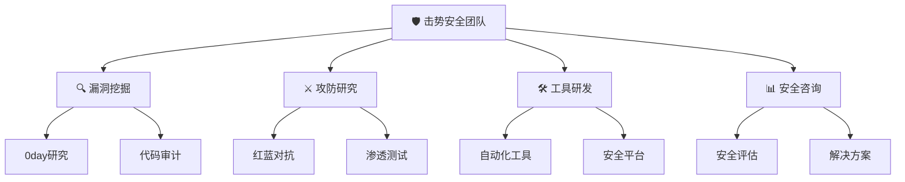

<!-- 动态Logo区域 -->

<!-- 主标题区域 -->
<h1>
  
</h1>

<!-- 渐变分割线 -->

<!-- 动态徽章组 -->

  
  
  
  

<!-- GitHub链接 -->

  
  

<!-- 波浪分割 -->

<!-- 团队简介卡片 -->
<table align="center">
<tr>
<td width="50%" valign="top">

### 🚀 关于我们

**击势安全团队**是一支专注于网络安全前沿技术的精英团队。我们以"**以点破面，重剑无锋**"为理念，深耕安全技术研究，致力于为网络安全领域带来创新与突破。

</td>
<td width="50%" valign="top">

### 🎯 核心业务

</td>
</tr>
</table>

<!-- 工具展示区域 -->
<h2 align="center">
  
  &nbsp;核心工具&nbsp;
  
</h2>

<!-- 工具卡片网格 -->
<table>
<tr>
<td width="50%">

### 🔧 [HackMITM](https://github.com/JishiTeam/HackMITM)
 

 高性能的Golang MITM代理工具

- ⚡ **高性能并发**：支持万级并发连接
- 🔐 **智能证书**：自动生成和管理SSL证书  
- 📊 **实时分析**：流量实时监控与分析
- 🔌 **插件扩展**：支持自定义插件开发

</td>
<td width="50%">

### 🔍 [WebFingerCat](https://github.com/JishiTeam/WebFingerCat)
 

 智能化Web指纹识别与信息收集

- 🎯 **精准识别**：多维度指纹识别技术
- 📈 **智能分析**：AI驱动的信息关联分析
- 🚀 **高效扫描**：分布式高速扫描引擎
- 📊 **可视化**：直观的结果展示界面

</td>
</tr>
<tr>
<td width="50%">

### 🤖 [DirAScan (DirA+)](https://github.com/JishiTeam/DirAScan)
 

 AI驱动的智能目录扫描工具

- 🧠 **AI算法**：机器学习优化扫描策略
- ⚡ **高效引擎**：多线程并发扫描架构
- 🎯 **智能过滤**：自动识别有效目录路径
- 📋 **多格式**：支持JSON/XML/CSV导出

</td>
<td width="50%">

### 🌱 [FuckSpringScan](https://github.com/JishiTeam/FuckSpringScan)
 

 Spring框架专项安全扫描

- 🎯 **专项扫描**：针对Spring生态的深度检测
- 🔐 **漏洞检测**：覆盖Spring全组件漏洞库
- 📊 **详细报告**：专业的漏洞分析报告
- 🛡️ **修复建议**：提供具体的安全加固方案

</td>
</tr>
</table>

<!-- 团队成员区域 -->
<h2 align="center">
  
  &nbsp;团队成员&nbsp;
  
</h2>

<!-- 团队成员卡片 -->
<table align="center">
  <tr>
    <td align="center" width="25%">
      
       
      <b>团队负责人</b>
       
      🎯 技术架构 | 团队管理
       
      
    </td>
    <td align="center" width="25%">
      
       
      <b>漏洞研究专家</b>
       
      🔍 0day挖掘 | 漏洞分析
       
      
    </td>
    <td align="center" width="25%">
      
       
      <b>红队专家</b>
       
      ⚔️ 渗透测试 | 攻击技术
       
      
    </td>
    <td align="center" width="25%">
      
       
      <b>开发工程师</b>
       
      🛠️ 工具开发 | 平台构建
       
      
    </td>
  </tr>
</table>

> 💡 **招募中**: 我们正在寻找更多志同道合的安全研究者加入我们的团队！

<!-- 统计数据 -->
<h2 align="center">
  
  &nbsp;团队统计&nbsp;
  
</h2>

  
  

  

<!-- 技术栈展示 -->

### 🛠️ 技术栈

 

 

<!-- 联系我们 -->
<h2 align="center">
  
  &nbsp;联系我们&nbsp;
  
</h2>

<!-- 联系方式卡片 -->
<table>
<tr>
<td align="center" width="33%">

 
<b>📧 邮箱联系</b>
 
<a href="mailto:team@jishi.security">team@jishi.security</a>
</td>
<td align="center" width="33%">

 
<b>💬 技术交流</b>
 
<a href="https://github.com/JishiTeam/discussions">GitHub Discussions</a>
</td>
<td align="center" width="33%">

 
<b>🔗 关注我们</b>
 
<a href="https://github.com/JishiTeam">GitHub Organization</a>
</td>
</tr>
</table>

<!-- 社交媒体链接 -->

<!-- 免责声明 -->
<h2 align="center">⚖️ 免责声明</h2>

<table width="80%">
<tr>
<td align="center">

 

本团队开发的所有工具仅供<b>安全研究</b>和<b>教育目的</b>使用。 
使用者应当遵守相关法律法规，不得用于非法用途。 
使用本工具进行任何违法活动造成的后果由使用者自行承担。

</td>
</tr>
</table>

<!-- 页脚 -->

<h3>

</h3>

<!-- 访客计数 -->

 